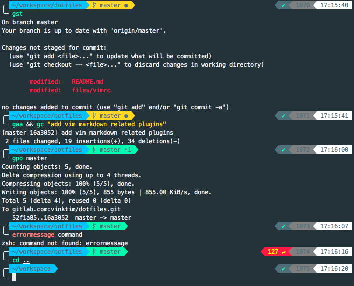
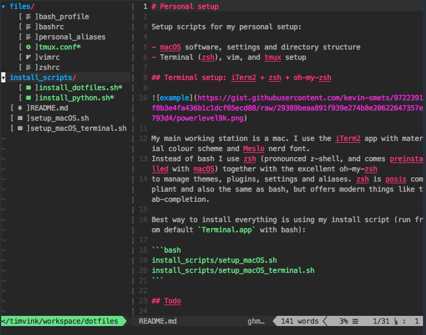

# Personal setup with dotfiles


## Ubuntu

You might need to `chmod +x` the shell scripts.

Run `install_software.sh`.

Manually download & install:

- google chrome
- VSCode


## MacOS




On mac I use iTerm2 + zsh + oh-my-zsh. I use the iTerm2 terminal app with material colour scheme and Meslo nerd font.
Instead of bash I use `zsh` together with the excellent `oh-my-zsh`
to manage themes, plugins, settings and aliases.

```bash
./setup-macos/setup_macOS.sh 
./setup-macos/setup_macOS_terminal.sh 
./install_scripts/install_dotfiles.sh
```
